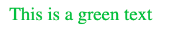
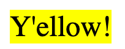

# Console HTML

Decorate your debug logs with the use of HTML and styling it with CSS, with the use of a new `console.html()` function

## Install

```
npm install console-html
```

## Setup

In order to use `console.html`, add the following line in your main html:

```html
<script src="../console-html.js"></script>
```

## Examples

Use the following examples to create styled text in your console. Press F12 to open your developer toolbar and click on the console tab to show the logs.

```js
console.html(`<div style="color:#00c040">This is a green text</div>`);
```

Console output:



---

You can also use the HTML "style" element to style your logs. It will basically take the styling from your site to use in the console.

```js
<style>
.niceBlue {
    color: white;
    background-color: #4060ff;
    padding: 10px;
    border-radius: 10px;
}
</style>
<script>
    console.html("<div class='niceBlue'>And this is a fancy text</div>");
</script>
```

Console output:


---

Instead of using a string, you can also use an Element object:

```js
const element = document.createElement("div");
element.style.color = "#000000";
element.style.backgroundColor = "#ffff00";
element.style.fontSize = "24px";
element.innerText = "Y'ellow!";
console.html(element);
```

Console output:



---

And even this:

```js
const svg = `<svg>{{SVG code here}}</svg>`;
const svgDataUrl = `data:image/svg+xml;base64,${btoa(svg)}`;
console.html(`<div style="background-image:url(${svgDataUrl});">Cheers!</div>`);
```

Console output:


---
